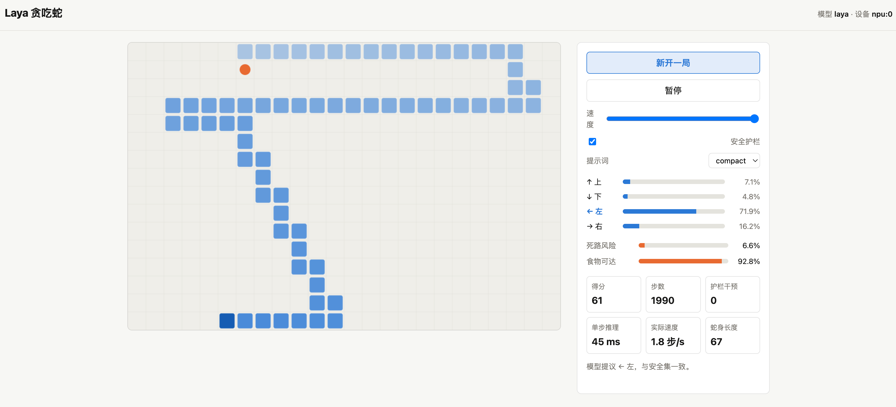

# Laya Examples

这个文档介绍仓库中的可运行示例。目前包含一个由 Laya 实时决策的贪吃蛇示例，支持 CPU 和 Ascend NPU。



## Snake：每一步都由 Laya 决策

贪吃蛇示例位于 [`examples/snake/`](examples/snake/)：

- `game.py`：确定性贪吃蛇规则、食物生成和循环安全规划器
- `policy.py`：每一步向 Laya 提三个问题
- `play.py`：终端 ASCII 可视化运行
- `server.py`：网页服务端
- `static/index.html`：Canvas 网页可视化
- `runtime.py` / `npu_patch.py`：CPU/NPU 选择、模型 warmup、NPU 决策头适配

每一步 Laya 会回答：

| 问题 | 类型 | 作用 |
|---|---|---|
| `move` | `choice` | 四个方向中哪个最安全且最接近食物 |
| `risk` | `noul` | 当前是否存在安全路线 |
| `food` | `noul` | 当前食物是否可达 |

外层还有一层确定性的安全护栏：只在模型提议的动作不安全时，从安全动作中重新选择。

## 网页可视化

```bash
cd /data/zzh/laya-Ascend

# CPU
.venv/bin/python examples/snake/server.py --device cpu --port 8010

# Ascend NPU
.venv/bin/python examples/snake/server.py --device npu:0 --port 8010
```

浏览器打开：

```text
http://127.0.0.1:8010
```

网页中可以：

- 新开一局、暂停/继续
- 调节速度
- 开关安全护栏
- 切换 compact / detailed 提示词
- 查看四个方向的概率
- 查看死路风险、食物可达性、得分、步数、护栏干预和单步推理耗时

## 终端运行

```bash
.venv/bin/python examples/snake/play.py --device cpu --steps 20
.venv/bin/python examples/snake/play.py --device npu:0 --steps 50
```

常用参数：

```text
--model     checkpoint 路径，默认 models/laya-multilingual
--device    auto / cpu / npu:0 / npu:1
--width     棋盘宽度，默认 24
--height    棋盘高度，默认 16
--seed      随机种子
--steps     最多执行步数
--prompt    compact / detailed
--no-guard  关闭安全护栏
```

## 模型

默认使用：

```text
models/laya-multilingual
```

也可以指定其他本地 checkpoint：

```bash
.venv/bin/python examples/snake/server.py \
  --model models/laya \
  --device npu:0 \
  --port 8010
```

Ascend NPU 环境准备见 [`README-Ascend.md`](README-Ascend.md)。

## HTTP API

网页服务端提供：

```text
GET  /api/info
POST /api/snake/new    {"guarded": true, "prompt": "compact", "seed": 7}
POST /api/snake/step   {"session": "..."}
```

完整示例说明见 [`examples/snake/README.md`](examples/snake/README.md)。

## 参考

贪吃蛇示例参考自 [AXERA-TECH/laya-axera](https://github.com/AXERA-TECH/laya-axera)。
