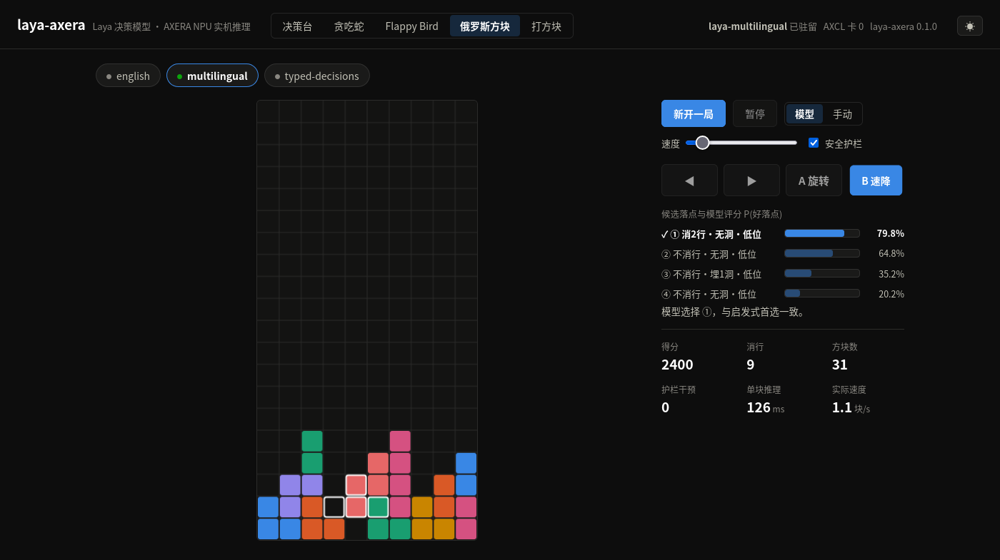

# Laya 俄罗斯方块示例



这是一个由 Laya 决策落点的俄罗斯方块示例，支持 CPU 和 Ascend NPU。

## 决策方式

每一步游戏会：

1. 枚举当前方块所有合法落点。
2. 用经典启发式打分，筛出 4 个候选落点。
3. 对每个候选构造一句统一的中文陈述：

```text
这个落点消除一行，不留空洞，堆叠保持低位。
```

4. 向 Laya 提一个 `noul` 问题：

```text
这是一个好的落点吗？
```

5. 选择 `P(好落点)` 最高的候选。
6. 安全护栏会避免选择靠近顶部的危险落点。

## 运行环境

先在根目录准备好依赖：

```bash
cd /data/zzh/laya-Ascend
source /usr/local/Ascend/ascend-toolkit/set_env.sh
```

默认模型：

```text
models/laya-multilingual
```

## 网页可视化

```bash
# CPU
.venv/bin/python examples/tetris/server.py --device cpu --port 8011

# Ascend NPU
.venv/bin/python examples/tetris/server.py --device npu:0 --port 8011
```

浏览器打开：

```text
http://127.0.0.1:8011
```

页面提供：

- Canvas 俄罗斯方块棋盘
- 新开一局 / 暂停 / 继续
- 速度调节
- 安全护栏开关
- 4 个候选落点及其 `P(好落点)`
- 每一步播放方块从顶部下落到目标位置的动画
- 得分、消除行、方块数、护栏干预、单块推理耗时

## 终端运行

```bash
.venv/bin/python examples/tetris/play.py --device cpu --pieces 10
.venv/bin/python examples/tetris/play.py --device npu:0 --pieces 20
```

常用参数：

```text
--model     checkpoint 路径，默认 models/laya-multilingual
--device    auto / cpu / npu:0 / npu:1
--seed      随机种子
--pieces    最多放置方块数
--no-guard  关闭安全护栏
```

## 文件说明

| 文件 | 说明 |
|---|---|
| `game.py` | 确定性俄罗斯方块规则、落点枚举和启发式候选筛选 |
| `policy.py` | 用 Laya 对候选落点评 `P(好落点)` |
| `play.py` | 终端 ASCII 运行 |
| `server.py` | 标准库 HTTP 服务 |
| `static/index.html` | Canvas 网页可视化 |
| `runtime.py` | 自动选择 CPU/NPU、加载模型和 warmup |
| `npu_patch.py` | 避免决策头回退 CPU 的等价 SDPA 实现 |

## API

```text
GET  /api/info
POST /api/tetris/new    {"guarded": true, "seed": 7}
POST /api/tetris/step   {"session": "..."}
```

`/api/tetris/step` 会返回 `before`（落子前棋盘）、`decision`（候选评分）、`state`（落子后棋盘）等字段，前端据此播放方块下落动画。

## 参考

俄罗斯方块的规则、候选筛选和提示词参考自
[AXERA-TECH/laya-axera](https://github.com/AXERA-TECH/laya-axera)。
